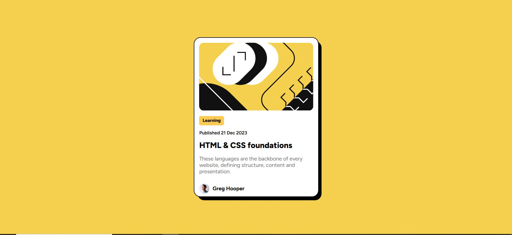

# Frontend Mentor - Blog preview card solution

This is a solution to the [Blog preview card challenge on Frontend Mentor](https://www.frontendmentor.io/challenges/blog-preview-card-ckPaj01IcS). Frontend Mentor challenges help you improve your coding skills by building realistic projects. 

## Table of contents

- [Overview](#overview)
  - [The challenge](#the-challenge)
  - [Screenshot](#screenshot)
  - [Links](#links)
- [My process](#my-process)
  - [Built with](#built-with)
  - [What I learned](#what-i-learned)
  - [Continued development](#continued-development)
- [Author](#author)

## Overview

### The challenge

Users should be able to:

- See hover and focus states for all interactive elements on the page

### Screenshot

### Links

- Solution URL: [GitHub](https://github.com/abigailjulie/FrontendMentor_BlogCard)
- Live Site URL: [Vercel](https://frontendmentorblogcard.vercel.app/)

## My process

### Built with

- Semantic HTML5 markup
- CSS custom properties
- Flexbox
- CSS Grid
- Mobile-first workflow

### What I learned

I learned to pay close attention to detail. The margins and the padding make a lot of difference in this image.

### Continued development

The use of the box-shadow really allows this image to pop. In the future I would like to implement smaller details like this to help the UI.

## Author

- Website - [Abigail Figaro](https://www.abigaildesigns.org)
- Frontend Mentor - [@abigailjulie](https://www.frontendmentor.io/profile/abigailjulie)
